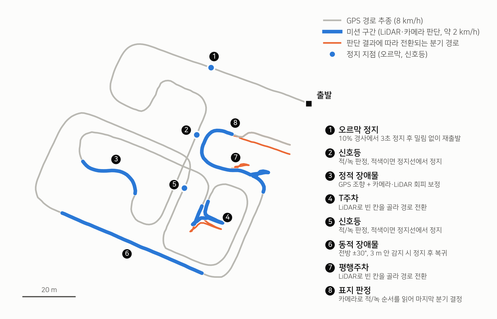
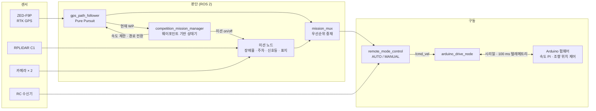
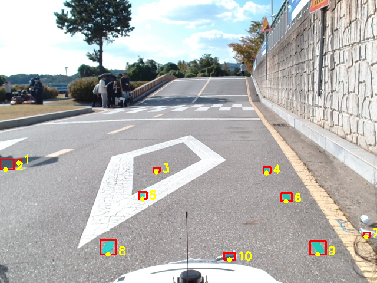
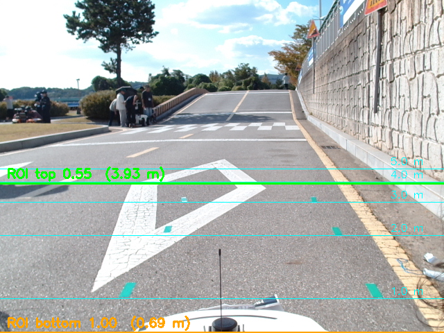
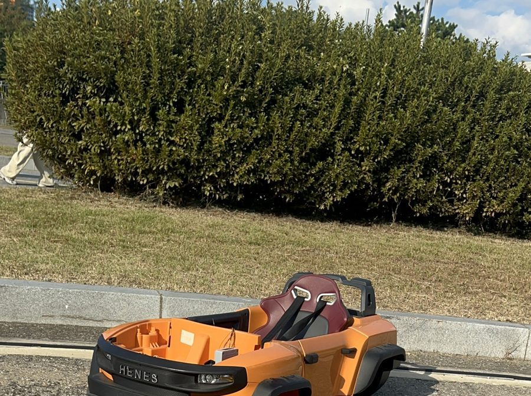

<div align="center">

# T870 Autonomous Driving

**브레이크도, 조향 서보도 없는 유아용 전동차를 RTK GPS · LiDAR · 카메라로 자율주행시킨 ROS 2 스택**


<picture>
  <source media="(prefers-color-scheme: dark)" srcset="docs/images/route_map_dark.png">
  
</picture>

<sub>실제 대회 경로 CSV(<code>gps_recordings/대회용</code>)로 그린 코스. 번호는 주행 순서다.</sub>

</div>

## 개요

Henes Broon T870은 사람이 타고 리모컨으로 모는 유아용 전동차다. 이 차를 하나의 코스에서
**경로 추종, 신호등, 장애물 회피, 주차까지 사람 개입 없이** 완주하도록 만든 프로젝트다.

기존 ERP42 / ROS 1 코드를 ROS 2 Jazzy로 옮기는 데서 시작했지만, 실제 차량은 외부 제어 입력을
받지 않았고 제동 장치도 없었다. 그래서 구동 펌웨어부터 미션 판단까지 전 계층을 이 차에 맞춰 다시 설계했다.

| | |
| :--- | :--- |
| **내 역할** | 소프트웨어 구조 전체 설계 · 구현, 프로젝트 총괄 |
| **주행** | RTK GPS 웨이포인트 약 700개를 Pure Pursuit으로 추종, 순항 8 km/h |
| **미션** | 오르막 정지 · 신호등 · 정적/동적 장애물 · T주차 · 평행주차 · 표지 판정 |
| **규모** | ROS 2 노드 29개, Arduino 펌웨어(구동 · 수신기 브리지), 경로 · 센서 진단 도구 10여 개 |
| **검증** | 하드웨어 없이 도는 pytest 294개, 대회 설정값과 코드의 불일치를 테스트로 차단 |

## 내 역할

**소프트웨어 구조를 처음부터 끝까지 직접 만들고, 프로젝트 전체를 총괄했다.**

- **소프트웨어 구조 설계 · 구현**: 센서 입력에서 구동 명령까지 이어지는 ROS 2 노드 구성 전체. 아래 [시스템 구조](#시스템-구조)가 그 결과물이다.
- **프로젝트 총괄**: 개발 방향과 우선순위 결정, 실차 시험과 대회 준비까지 전 과정을 이끌었다.

## 시스템 구조



설계의 중심은 세 가지다.

- **웨이포인트가 곧 시간표다.** 미션 매니저는 현재 웨이포인트 번호만 보고 센서를 켜고, 속도를 제한하고, 경로 파일을 교체한다. 미션마다 따로 위치를 추정하지 않는다.
- **명령은 한 곳으로만 나간다.** 모든 미션 출력은 우선순위 Mux를 거친다(긴급정지 > 주차 > 회피 > 신호등 > GPS 추종). 미션 명령이 0.5초 끊기면 Mux가 속도 0을 낸다.
- **사람이 항상 이긴다.** 최종 명령은 조종기의 AUTO/MANUAL 게이트를 통과해야 하고, 수신기가 끊기면 펌웨어가 구동을 차단한다.

## 미션

| # | 미션 | 센서 | 동작 |
| :-: | :--- | :--- | :--- |
| 1 | 오르막 정지 | 엔코더 | 10% 경사에서 3초 정지. 밀리는 속도에 비례한 역토크로 버틴 뒤 재출발 |
| 2, 5 | 신호등 | 카메라 | 판단 구간에서 본 라벨의 최빈값으로 판정. 적색이면 정지선에서 정지 |
| 3 | 정적 장애물 | 카메라 + LiDAR | GPS 조향을 유지한 채 회피 보정각을 더하고, 3 m 안에서는 회피가 조향을 넘겨받음 |
| 4 | T주차 | LiDAR | 빈 칸을 판단해 해당 칸의 경로 파일로 전환, 후진 구간 포함 |
| 6 | 동적 장애물 | LiDAR | 전방 ±30°, 3 m 안에 3점 이상 잡히면 즉시 정지, 3초 뒤 복귀 |
| 7 | 평행주차 | LiDAR | 빈 칸을 판단해 경로 전환 |
| 8 | 표지 판정 | 카메라 | 적/녹 표지의 좌우 순서를 읽어 마지막 분기 결정 |

주차와 분기는 "판단 결과에 맞는 경로 CSV로 갈아 끼우는" 방식이다. 경로 파일끼리 전환 지점의
웨이포인트 번호를 맞춰 두어, 주행 중에 파일을 바꿔도 추종이 끊기지 않는다.

## 문제 해결 기록

코드보다 설명이 필요한 부분만 골랐다. 수치는 모두 작업 기록(`T870_COMPETITION_HANDOFF_2026-09-19.txt`)에 근거가 있다.

### 1. 외부 입력을 무시하는 차량: 구동 계층을 직접 만들다

처음 설계는 Pixhawk가 조향과 스로틀 PWM을 내는 구조였다. 실차에서는 성립하지 않았다.

- 차량 내장 STM 제어보드가 외부 스로틀 입력을 무시했다.
- 조향 모터가 서보가 아니라 DC 모터여서, PWM을 주면 각도가 아니라 속도로 해석해 끝까지 돌아갔다.

그래서 최하단만 교체했다. Arduino가 STM 보드를 우회해 모터 드라이버를 직접 구동하고,
엔코더로 속도 PI 제어를, 포텐셔미터로 조향 위치 제어를 한다. 상위 스택은 `/cmd_vel` 인터페이스를
그대로 쓰므로 바꾸지 않았다. 펌웨어는 조종기 입력부터 모터 PWM까지 전 단계를 100 ms마다 한 줄로
보고해, 차가 안 움직일 때 어느 단계에서 끊겼는지 바로 가려진다(`arduino_check.py`).

### 2. 브레이크가 없는 차를 세우기

모터 드라이버(Cytron MDD20A)에는 브레이크 입력이 없고, PWM 0은 관성주행이다.

- 감속 램프만으로는 8 km/h에서 정지까지 **11.4초, 12.7 m**가 걸려 동적 장애물에 쓸 수 없었다.
- 10% 오르막에서 3초간 구동을 놓으면 마찰을 무시한 계산으로 **4.4 m**를 뒤로 밀린다.

정지를 두 종류로 나눴다. 안전 정지는 PWM을 즉시 차단하고, 규정 정차는 구동을 놓지 않고 밀리는
속도에 비례한 역토크로 버틴다. 안전 정지에 홀드 토크를 붙이면 "비상정지인데 모터가 도는" 상황이
되므로 둘을 섞지 않았다. 또 LiDAR를 켜는 지점에서는 이미 미션 속도(2 km/h)가 되도록 5 웨이포인트
전부터 선형 감속한다. 오르막 정지 미션은 실차에서 성공했다.

### 3. 카메라가 잔디를 장애물로 봤다

<table>
<tr>
<td width="50%"></td>
<td width="50%"></td>
</tr>
<tr>
<td align="center"><sub>바닥 표식을 색으로 자동 검출해 호모그래피 계산</sub></td>
<td align="center"><sub>화면 행을 지면 거리로 환산해 ROI를 4 m 지점에 설정</sub></td>
</tr>
</table>

정적 장애물 구간에서 차가 마른 잔디를 보고 멈췄다. 원인은 두 가지였다.

- **ROI를 눈대중으로 정했다.** 호모그래피로 역산하니 기존 ROI 상단(화면 35%)은 전방 22 m였고, 그 위는 지평선 너머였다. 먼 배경이 근거리 덩어리와 이어지면서 "아주 가까운 장애물"로 읽혀 최대 조향이 걸렸다. ROI를 **거리 기준(전방 4 m)** 으로 다시 잡고, 차로 폭만 보는 사다리꼴로 좁혔다.
- **색 기준이 틀렸다.** 실차 사진의 픽셀을 직접 재 보니 주황 장애물과 마른 잔디를 가르는 것은 채도가 아니라 hue였다. 임계값을 다시 탐색해 장애물 차체 화소의 검출률이 **43.8% → 73.0%** 로 올랐고 잔디 오검출은 0.1%에 머물렀다.



### 4. 헤어핀에서 코너를 잘랐다

장애물 구간은 곡률반경 약 7 m, 누적 방향변화 108°의 헤어핀이다. 저속 구간의 전방주시거리 5.0 m는
여기서 너무 길어 최대 횡오차가 0.80 m였다. 구간별로 전방주시거리를 덮어쓰는 파라미터를 추가해
1.0 m로 줄이자 횡오차는 **0.22 m**가 됐다. 조향률 제한이 있어 짧은 주시거리에서도 진동하지 않았다.

### 5. 현장에서 되살아나는 버그를 테스트로 막다

대회 경로는 QGIS에서 편집한다. 그런데 다시 내보낼 때마다 인코딩이 CP949로 돌아가 노드가 죽거나,
수동으로 넣은 점의 순서가 뒤바뀌는 문제가 반복됐다. 사람이 기억하는 대신 테스트가 잡도록 했다.

- `test_competition_csv_integrity`: 대회용 CSV의 인코딩과 점 순서 검사
- `test_lidar_mission_table_matches_launch`: 미션 매니저의 구간 표와 launch 파일의 설정이 같은지 대조
- GPS 점프 복구, 장애물 인계, 주차 칸 매핑 등 판단 로직은 ROS 없이 단위 테스트로 검증

```bash
PYTHONPATH=src/t870_control:$PYTHONPATH /usr/bin/python3 -m pytest src/t870_control/test -q
# 294 passed
```

## 기술 스택

| 영역 | 사용 기술 |
| :--- | :--- |
| 미들웨어 | ROS 2 Jazzy (rclpy), MAVROS, robot_localization |
| 위치 | u-blox ZED-F9P RTK, UTM 52N(EPSG:32652), QGIS 기반 경로 편집 |
| 인지 | RPLIDAR C1 섹터 판정, OpenCV HSV 검출, BEV 호모그래피 |
| 제어 | Pure Pursuit, 속도 PI, 조향 위치 루프, 우선순위 Mux |
| 펌웨어 | Arduino UNO (C++), 엔코더 인터럽트, I2C 수신기 브리지 |
| 하드웨어 | Pixhawk 6C, Cytron MDD20A, Logitech C920e |
| 검증 | pytest 294개 |

## 저장소 구조

```
.
├── run.sh / watch.sh / t870_cleanup.sh   실행, 주행 모니터, 노드 정리
├── src/t870_control/        핵심 패키지: 노드 29개, launch, 설정, 테스트
├── src/ma_rrt_path_plan/    LiDAR + IMU 기반 RRT 로컬 경로 계획
├── gps_recordings/대회용/    대회 주행 경로 CSV 5개
├── sketch_aug/              주 Arduino 펌웨어 (구동 + 조향)
├── pwm_receiver_bridge/     RC 수신기 → I2C 브리지 펌웨어
├── bev_calib/               카메라 BEV · ROI 캘리브레이션, 상태 대시보드
├── path_*.py, rtk_*.py ...  경로 편집 · 센서 진단 도구
└── *.txt, *.md              날짜별 작업 기록과 인수인계 문서
```

## 빌드와 실행

모델 가중치와 영상은 Git LFS로 저장돼 있다.

```bash
sudo apt install git-lfs && git lfs install
git clone https://github.com/Sxx-xx/t870-autonomous-driving.git && cd t870-autonomous-driving

source /opt/ros/jazzy/setup.bash
colcon build --base-paths src/t870_control \
  --build-base build_t870 --install-base install_t870

./run.sh              # 장치 점검 → MAVROS → 통합 launch → 대시보드
./run.sh --log        # 대시보드 대신 필터링한 로그
./watch.sh            # 다른 터미널에서 주행 상태 모니터
```

조종기 AUTO가 주행, MANUAL이 정지다. `Ctrl-C` 한 번이면 전부 종료된다.
새로 클론했다면 MAVROS, sllidar_ros2 등 의존 패키지도 `--base-paths`에 넣어 먼저 빌드해야 한다.

<details>
<summary><b>경로 · 진단 도구</b></summary>

| 스크립트 | 용도 |
| :--- | :--- |
| `path_to_qgis.py` | 기록한 경로 CSV → QGIS용 GeoPackage |
| `path_qgis_project.py` | GeoPackage → 위성지도 배경이 붙은 QGIS 프로젝트 |
| `gpkg_to_path.py` | QGIS 편집 결과 → 주행용 CSV |
| `path_speed_profile.py` | 곡률에 맞춰 점별 목표속도 재계산 |
| `path_mark_reverse.py` | 경로의 특정 구간을 후진으로 표시 |
| `path_shift.py`, `path_anchor.py` | 경로 전체 평행이동 (수동 / 현재 위치 기준) |
| `path_offset_check.py` | 차를 경로 위에 세우고 수신기 위치 오차 확인 |
| `rtk_monitor.py`, `rtk_walk_check.py` | RTK 끊김 기록 |
| `ubx_config.py` | u-blox 수신기 설정 조회 · 변경 |
| `scan_check.py` | 판정 지점에서 LiDAR에 보이는 물체의 각도 · 거리 측정 |
| `arduino_check.py` | Arduino 텔레메트리로 구동이 끊긴 단계 진단 |
| `traffic_calib/probe.py` | 신호등 후보가 어느 필터에서 탈락하는지 단계별 집계 |

</details>

<details>
<summary><b>문서</b></summary>

| 파일 | 내용 |
| :--- | :--- |
| `T870_COMPETITION_HANDOFF_2026-09-19.txt` | 대회 통합 작업 기록과 인수인계 (가장 최신) |
| `t870_competition_notes.txt` | 대회 현장 메모 |
| `T870_MISSIONS.md` | 미션 노드와 실행 인자 |
| `t870_parking_notes.txt`, `t870_parallel_parking_notes.txt` | 주차 미션 |
| `traffic_light_notes.txt` | 신호등 검출 |
| `t870_actuator_redesign.txt` | 구동 · 조향 계통 재설계 |
| `t870_migration_summary.txt` | ERP42 / ROS 1 → T870 / ROS 2 이식 정리 |
| `t870_progress_*.txt` | 날짜별 작업 기록 |

</details>

<details>
<summary><b>외부 패키지 출처</b></summary>

`src` 아래의 다음 패키지는 외부 저장소에서 가져왔고, 일부는 이 차량에 맞게 수정했다.
각 패키지의 라이선스는 해당 폴더의 LICENSE를 따른다.

| 패키지 | 원본 |
| :--- | :--- |
| `mavros` | https://github.com/mavlink/mavros |
| `sllidar_ros2` | https://github.com/Slamtec/sllidar_ros2 |
| `ublox` | https://github.com/KumarRobotics/ublox |
| `gps_umd` | https://github.com/swri-robotics/gps_umd |
| `rtcm_msgs` | https://github.com/tilk/rtcm_msgs |
| `HesaiLidar_General_ROS` | https://github.com/HesaiTechnology/HesaiLidar_General_ROS |
| `adaptive_clustering` | https://github.com/yzrobot/adaptive_clustering |
| `lanenet-lane-detection-pytorch` | https://github.com/IrohXu/lanenet-lane-detection-pytorch |
| `morai_msgs` | https://github.com/morai-developergroup/morai_msgs |
| `ma_rrt/ma_rrt_path_plan` | https://github.com/ekampourakis/ma_rrt_path_plan |
| `t870_track/common_msgs` | https://github.com/ros/common_msgs |

</details>
